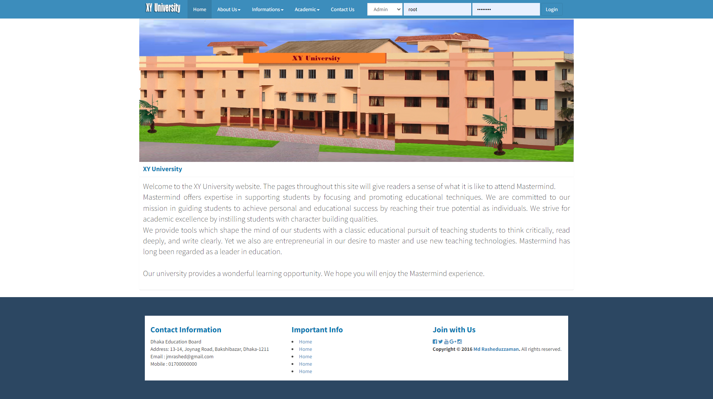

# University Management System

The University Management System is a web-based application developed using PHP. It provides a comprehensive solution for managing various aspects of a university, including student management, course management, faculty management, and administrative tasks.

## Features

- **Student Management**: Allows administrators to add, edit, and delete student records. It includes features for student registration, enrollment in courses, and generating student reports.
- **Course Management**: Provides functionality to manage courses offered by the university. Administrators can add new courses, update course details, and assign faculty members to courses.
- **Faculty Management**: Allows administrators to manage faculty information. They can add new faculty members, update their profiles, and assign them to courses.
- **Attendance Tracking**: Provides a system for tracking student attendance in classes. Faculty members can mark attendance for their respective courses, and administrators can generate attendance reports.
- **Grading System**: Enables faculty members to assign grades to students based on their performance in assignments, quizzes, and exams. The system calculates the overall grade for each student.
- **Administrative Tasks**: Includes administrative features such as user management, generating reports, managing departments, and handling other administrative tasks.

# Demo 

## Installation

To set up the University Management System, follow these steps:

1.  Clone the repository or download the ZIP file.

    bashCopy code

    `git clone https://github.com/jmrashed/university-management-system-php.git`

2.  Set up a web server with PHP support (e.g., Apache or Nginx).
3.  Create a new MySQL database for the system.
4.  Import the database schema and sample data from the `database` folder into the newly created database.
5.  Update the database configuration in the `config.php` file located in the root directory of the project.
6.  Start your web server.
7.  Open your web browser and navigate to the URL where the project is hosted.
8.  Login using the default administrator credentials:

    - Username: admin
    - Password: admin123

9.  Once logged in, you can customize the system settings, add departments, courses, students, faculty members, and perform other administrative tasks.

## Usage

The University Management System provides different user roles with different capabilities:

- **Administrator**: Administrators have full access to all system features, including managing users, courses, students, faculty, and generating reports.
- **Faculty**: Faculty members can manage the courses they are assigned to, mark attendance, assign grades, and view student details.
- **Student**: Students can view their course information, attendance records, grades, and update their profile.

Customize the system roles and permissions as per your university's requirements.

## Contributing

Contributions to the University Management System are welcome. If you have any ideas, improvements, or bug fixes, feel free to submit a pull request.

## License

This project is licensed under the [MIT License](https://chat.openai.com/LICENSE). You are free to modify and use the code as per the terms of the license.

## Contact

If you have any questions or need further assistance, feel free to contact the project maintainer at [jmrashed@gmail.com](mailto:jmrashed@gmail.com).
